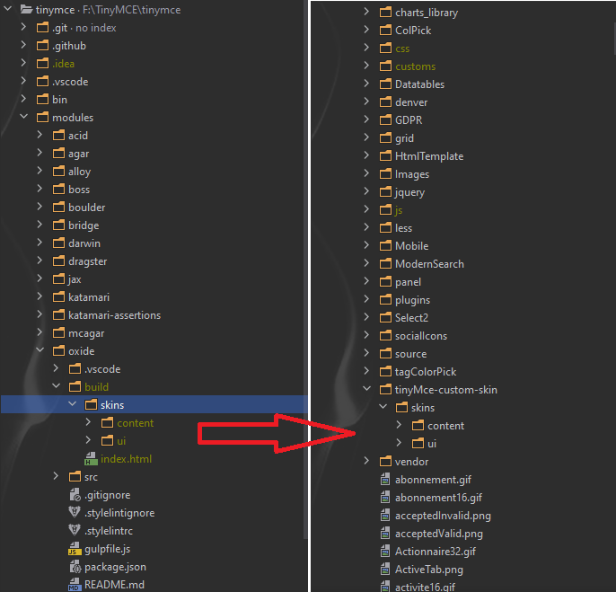
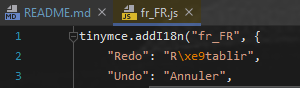

# TinyMCE

## Editor setup

Steps to run the tinyMce editor:

1. Open terminal / shell and navigate to root folder of cloned repo
2. Run: `yarn install`
3. To start the tinyMce after install run `yarn oxide-start`
4. App will start at http://localhost:3000

Note: Changes made while editor is running will be applied automatically at save.\
Note: If only build is wanted without starting the app, run: `yarn oxide-build`

## Creating new skin

Navigate to modules/oxide/src/less/skins/. There are two folders in this location:

- `ui` - which is the skins for the editor. The important file here is skin.less.
- `content` - which is the skins for the content within the editor.

### Create / Edit skin

1. Begin by duplicating the default folder located in `modules/oxide/src/less/skins/ui/` and rename it to the name of your skin.
2. Start the development server using the terminal command `yarn oxide-start`. If you already have the server running, you need to restart it to make it recognize your new skin using ctrl-c and then start it again.
3. Open the file `modules/oxide/src/less/skin/ui/<your-skin-name>/skin.less`.
4. Open any less file located in the theme folder, for example `modules/oxide/src/less/theme/globals/global-variables.less` and copy a variable you like to change, it’s easiest to copy the whole line.
5. Paste the variable into the skin.less file you opened in step 3. For a test, change the variable value to be red, like this:` @background-color: red;`. Then save the file.

### Applying new / edited skin to editor and publisher

1. Navigate to Publisher `Release/Res/tinyMce-custom/skins` which will contain two folders, `content` and `ui`, delete them
2. Navigate to tinyMce project `modules/oxide/build/skins/` which will contain  `content` and `ui`
3. Copy `content` and `ui` folders to the Publisher
4. Rebuild Publisher
5. Restart Editor

Note: `Publisher` and `editor` are using same resource.

## Update / add language pack to TinyMCE

To update / add another language to TinyMCE it is simple process of copy paste.

Add language pack:
1. Visit https://www.tiny.cloud/get-tiny/language-packages/
2. Download language pack you want to add to TinyMCE
3. Unzip package and paste it to `F:\Publisher\Release\Res\tinyMce-custom\language`
4. Check if name of the package match the name used in app (eg in notes)
5. In case that package name is not correct, rename file to desired name and open file and repeat the name in method `addI18n` (image below)
   

Notes:
Some packages may not have the name that we use in app, for example French package is named\
`fr_FR` and in app we are expecting to be called `fr`.

# Css inline

As TinyMCE is setting all of the css in `<style>` tag problems with mailing to Gmail occurs so we have to place css in each html tag, it is done with `Juice` library.\
Link to git: https://github.com/Automattic/juice
